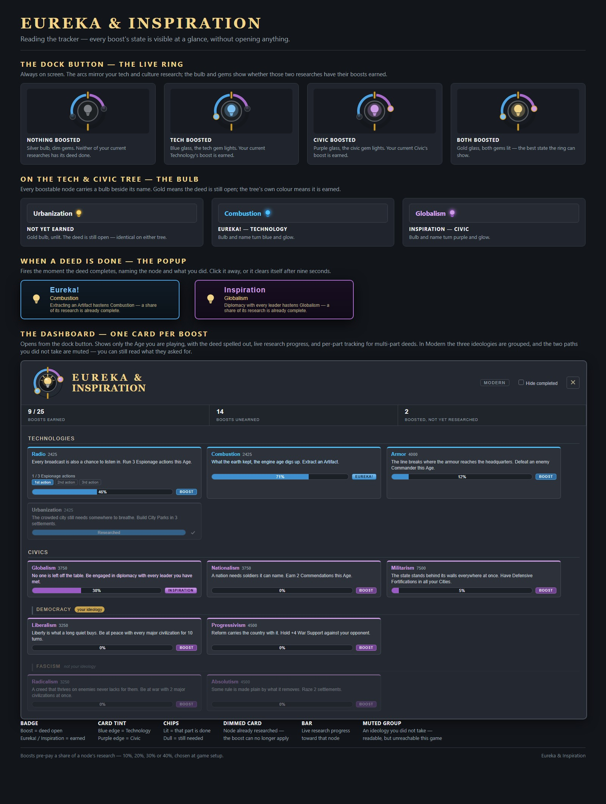

# Eureka & Inspiration

Civilization VI's boosts, rebuilt for Civilization VII.

Every base-game Technology and Civic that can take a boost gets a thematic deed. Do the deed and a
**Eureka!** or **Inspiration** fires, pre-paying a share of that node's research. Quarry two blocks of
stone and Masonry is already half-learned; meet two civilizations and Writing comes quicker.

**70 boosts across all three Ages** — 23 in Antiquity, 22 in Exploration, 25 in Modern. The full list
is in [docs/DEED-LIST.md](docs/DEED-LIST.md).



## How much a boost pays

You choose at game setup: **10%, 20%, 30% or 40%** of the node's research, pre-paid the moment the
deed completes. 40% is the default and matches Civ VI's feel; 10% is for players who want the deeds
as flavour rather than acceleration.

A boost that lands on a node you have already researched pays nothing — it is a head start, not a
refund.

## Seeing what you are chasing

The mod's own tracker means you never have to guess which deed is outstanding.

- **A dock ring, always on screen.** Its two arcs mirror your current Technology and Civic research.
  The bulb tells you at a glance whether those two researches have their deeds done — silver for
  neither, blue for the tech, purple for the civic, gold for both.
- **A bulb on every node** in the tech and civic trees. Gold means the deed is still open; the tree's
  own colour means it is earned.
- **A popup when a deed completes**, naming the node and what you did.
- **A dashboard**, one card per boost, showing the deed in plain words, live research progress, and
  **N / M counters for deeds that count things** — so "defeat 12 units" is never a mystery. In Modern
  the three ideologies are grouped, and the two paths you did not take are muted rather than hidden.

## The deeds

Every deed follows the same rules, learned the hard way over a lot of testing:

- **Never satisfied by what you carried in.** An Age flip hands you buildings, units, commanders and
  a developed empire; an advanced start hands you more. A deed either names something that cannot
  exist before its Age, or counts events that happen *during* it.
- **Never dependent on what the AI chooses to build.** An early version of one deed asked you to
  shoot down an aircraft — the AI barely builds aircraft, so a whole Age could pass with no target.
  Deeds key on things the player controls or the opponent cannot avoid.
- **Never satisfied on turn 1**, and never by a map roll alone.
- **Stated in the game's own words.** If the deed says Farming Town, it means the focus of that name.

## Install

**Steam Workshop** — subscribe and enable in the Add-Ons menu.

**Manual** — copy the `eureka-inspiration` folder into:

```
%LOCALAPPDATA%\Firaxis Games\Sid Meier's Civilization VII\Mods\
```

Then enable it in **Add-Ons** and start a **new game**. Mod content is read when a game is created,
so an existing save will never see it.

## Compatibility

Base game plus all DLC. The mod adds boosts to base-game nodes and does not replace or modify any
existing content, so it sits alongside other mods cleanly.

Its one point of contact with other UI mods is the tech/civic tooltip. The rule there is **pristine or
withdraw**: the mod decorates the tooltip only if nothing else has touched it, and removes its own
decoration if something else arrives later. It never depends on another mod's classes or tags.

Political Theory's deed enumerates every civilization's unique civics tree, and that list is
regenerated from your installed game — so a new civilization DLC is picked up by re-running the
generator rather than by a code change.

## Build from source

The data is generated, not hand-written, so the boosts can never drift from the deeds that award them.

```
python tools/gen-eni-mo-political-theory.py  # the per-civ unique-civics markers, swept from your install
python tools/gen-eni-step-trackers.py      # the dashboard's N / M progress trackers
python tools/gen-eni-aq-boosts.py          # Antiquity boosts, mirrored from the markers
python tools/gen-eni-ex-boosts.py          # Exploration
python tools/gen-eni-mo-boosts.py          # Modern (also writes the bind rows)
python tools/gen-eni-deed-list.py          # docs/DEED-LIST.md
python tools/check-eni-drift.py            # the build gate - see below
```

Order matters and is not alphabetical: the unique-civics generator writes markers, the tracker
generator clones those markers, the boost generators mirror every marker and sweep the trackers into
the bind files, and the deed list reads the shipped text last. `publish-eni.ps1` runs them in that
order for you.

`check-eni-drift.py` is what keeps the mod honest. It fails the build if a boost's requirements no
longer match the marker that awards it, if a generated civ list has gone stale against the installed
game, if a story deed is missing a text tag or points at a modifier that does not exist, if a step
tracker is defined but never attached, or if a UI file does not parse as a module. Every one of those
failures is silent in-game — no error, no log line, the deed simply never fires — which is why they
are checked mechanically rather than by eye.

## Credits & license

MIT. Original code and art; no Firaxis assets are redistributed.

Built with heavy use of in-game testing — most of the numbers in this mod were changed at least once
because a playthrough proved the first guess wrong.
